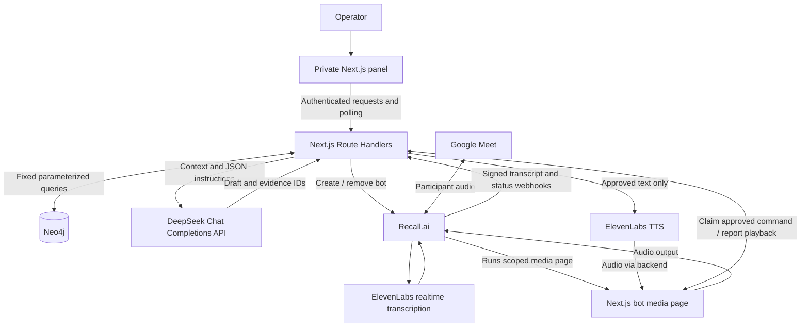

# MyDuo — Architecture and implementation contracts

Status: proposed design, not implemented. Read [PRD](PRD.md) for product requirements.

## 1. Decisions

- One Next.js App Router application with TypeScript and Node-runtime Route Handlers.
- A separate private operator panel and a separate, narrowly authorized bot media page.
- One Neo4j database for memory and durable application records; no second database or ORM.
- Recall.ai handles Google Meet participation, ElevenLabs transcription delivery, and Output Media.
- DeepSeek generates structured suggestions; ElevenLabs synthesizes the approved text.
- HTTP polling for the panel and bot command channel. No custom WebSocket server, Redis, message broker, or background agent framework.
- One Render Web Service hosts the persistent Next.js server and public HTTPS routes. Use a non-sleeping instance for the live demo so webhook delivery and meeting controls do not wait for a cold start.

These choices are sized for one operator and one active meeting. They are not a production multi-tenant service design.

## 2. System diagram



The media page is executed by Recall, not by the operator's browser. Audio played in the operator panel would only play locally and is not the meeting delivery mechanism.

## 3. Tech stack and version policy

| Component | Baseline | Implementation rule |
| --- | --- | --- |
| Next.js | Stable Next.js 16 release | Pin a verified patch during setup; use App Router and Node runtime. |
| React / React DOM | Versions compatible with selected Next.js release | Use the scaffold's supported pair and record exact versions. |
| Node.js | Node.js 24 LTS | Verify compatibility with chosen pnpm/dependencies; pin runtime metadata. |
| pnpm | Current compatible stable release | Exact `packageManager` pin plus committed `pnpm-lock.yaml`; no npm/yarn lockfile. |
| TypeScript / ESLint | Scaffold-compatible versions | Strict TypeScript; lint separately from build. |
| Styling | CSS Modules and global CSS | Native buttons, textarea, labels, focus styles; no UI dependency initially. |
| Neo4j | AuraDB, compatible supported database release | Official `neo4j-driver`; verify account tier/capacity in setup. |
| Recall | REST API and signed webhook delivery | Native `fetch`; use account's region and current payloads. |
| LLM | DeepSeek Chat Completions API | OpenAI-compatible `openai` SDK with DeepSeek base URL; model set in `DEEPSEEK_MODEL`; validate JSON output and account access. |
| Voice | ElevenLabs TTS | Official `@elevenlabs/elevenlabs-js` SDK; configured stock voice and low-latency compatible model. |
| STT | ElevenLabs `scribe_v2_realtime` through Recall | Use committed `transcript.data`; no dependency on partial events. |
| Input validation | Zod | Validate app inputs, normalized provider payloads, and model output at boundaries. |
| Webhook verification | Provider-documented verifier | Prefer the documented maintained verifier (for example Svix where specified); choose after checking actual signature format. |
| Small checks | Node `assert` / `node:test` through `tsx` | One compact runnable contract/regression entrypoint; no broad test framework by default. |
| Hosting | Render Web Service | Run the dynamic Next.js server with `pnpm install --frozen-lockfile && pnpm build`, `pnpm start`, a health route, and an explicit `APP_BASE_URL`. |

Next.js supports Route Handlers for webhooks and a Node server deployment. Its current setup documentation supports pnpm, and lint is a separate check from production build. [Next.js installation](https://nextjs.org/docs/app/getting-started/installation), [Route Handlers](https://nextjs.org/docs/app/api-reference/file-conventions/route), [self-hosting](https://nextjs.org/docs/app/guides/self-hosting).

pnpm's frozen-lockfile install rejects manifest/lockfile drift. [pnpm install](https://pnpm.io/cli/install). Neo4j has an official JavaScript driver. [Driver manual](https://neo4j.com/docs/javascript-manual/current/).

The package list is a plan, not an instruction to install every possible provider SDK. Do not add LangChain, LangGraph, a monorepo, a vector database, or a custom dependency-injection layer.

## 4. Request and event flows

### 4.1 Meeting creation

1. Authenticate operator; validate an HTTPS Google Meet URL against an exact allowed host and expected meeting path. Do not fetch arbitrary submitted URLs.
2. Atomically reserve the operator's single active session in Neo4j. Generate application IDs before provider calls.
3. Create a meeting-scoped media bootstrap credential; store only its hash. Build the media page URL from trusted `APP_BASE_URL`, not request headers.
4. Create the Recall bot with a visible name, selected realtime transcription provider, transcript webhook endpoint, and Output Media page.
5. Persist the provider bot ID and normalized status. If creation times out after possible provider acceptance, show an uncertain state and reconcile provider state before retrying. Do not create another bot blindly.
6. Status events update the session. The media page reports readiness; speech is disabled until it is ready and the bot can participate.

### 4.2 Transcript ingestion

1. Read raw request bytes and validate the provider signature/timestamp before parsing or writing.
2. Confirm that the provider bot ID belongs to a known session. Unknown bot events cannot create application sessions.
3. Validate and normalize committed transcript events. Use provider event identity for delivery deduplication and stable utterance identity for corrections where supplied.
4. Store the utterance and increment a monotonic application transcript revision in one transaction. Preserve speaker ID, available display name, timestamps, and finality; use “Unknown speaker” when needed.
5. Return success only after durable acceptance. No LLM/TTS call runs in the webhook handler.
6. The operator polls the current state once per second while the panel is active. Return bounded recent utterances and latest suggestion state, with `Cache-Control: private, no-store`.

Normalize bot utterances separately and exclude them from suggestion triggers/retrieval context unless deliberately needed as prior approved contributions. Do not mute all human transcript ingestion while the bot speaks.

Recall distinguishes realtime endpoint events from status delivery. Current verification guidance describes workspace signatures and legacy status-secret differences; verify both configured routes using their actual secrets. Realtime delivery has bounded retries, so persistent failure must become a visible degraded state. [Verification](https://docs.recall.ai/docs/authenticating-requests-from-recallai), [realtime delivery](https://docs.recall.ai/docs/real-time-webhook-endpoints).

### 4.3 Suggestion generation

1. Receive mode, selected utterance IDs or operator question, and observed transcript revision.
2. Capture an immutable context snapshot: selected question, recent committed utterances, selected project, and allowed profile fields.
3. Retrieve a bounded set of confirmed, non-superseded facts from the selected project with their supporting sources. Exclude sources that are not enabled for meeting use before sending context to the model.
4. Use fixed parameterized Cypher. Start with selected-project retrieval and a one/two-hop expansion for owners/dependencies; no LLM-written Cypher and no embedding pipeline.
5. Submit bounded context to one DeepSeek model in JSON output mode, with explicit schema instructions in the prompt. Use recent transcript as data, not instructions. The model receives no tool for approving speech, changing memory, or fetching arbitrary URLs.
6. Validate result shape and ensure all evidence IDs belong to the supplied source/utterance set. Refusal, malformed output, missing evidence, and timeout are handled explicitly.
7. Store the draft with revision, version, and evidence references. Return it privately. Do not save generated assertions as confirmed memory.

DeepSeek's JSON output mode constrains the response to JSON, while the application schema validator enforces the expected fields and evidence IDs. Neither establishes factual correctness. [DeepSeek JSON output](https://api-docs.deepseek.com/guides/json_mode).

Initial context limits: last 5 minutes or 40 utterances, whichever is smaller; at most 20 retrieved facts and 12,000 source characters; one model request per explicit assistance action. Configuration can be tuned after measured results.

### 4.4 Approval and speech

1. Operator approves a specific suggestion version and exact text. If the transcript has advanced or the card is more than 60 seconds old, require an explicit review-again confirmation tied to the current revision; do not silently use old approval.
2. Atomically persist an immutable speech command with a unique client request ID. At most one active command exists per session. Duplicate submissions return the existing command.
3. The media page polls at an initial 500 ms interval and atomically claims the queued command. A second page cannot claim it again.
4. The media page requests audio for the claimed command. The backend verifies command state and media authority and calls ElevenLabs using only the stored approved text. The media client cannot supply arbitrary TTS text.
5. For the first working version, receive a short complete MP3 through the protected backend route, create an in-browser object URL, and play it. This intentionally buffers the short response and avoids a custom audio streaming pipeline. If measured latency misses the PRD target, implement streaming playback inside this same page.
6. Report playback started, ended, or failed using the command ID. The operator sees preparing, speaking, completed, or error. Revoke object URLs after use.
7. No automatic playback retry follows a lost acknowledgement or page crash. Mark the outcome uncertain and require a new operator action, since exactly-once audible output cannot be guaranteed across network failures.

Audio bytes are not stored in Neo4j or public files. A disconnected synthesis/playback request fails or becomes uncertain instead of becoming an untracked background job.

Use Recall **Output Media** for this flow. Recall runs a webpage and outputs its audio into the call. The separate `output_audio` endpoint is not designed for interactive generated conversation. [Output Media](https://docs.recall.ai/docs/stream-media), [Output Audio limitations](https://docs.recall.ai/reference/bot_output_audio_create). ElevenLabs supports TTS streaming for a later latency improvement. [ElevenLabs streaming](https://elevenlabs.io/docs/eleven-api/guides/how-to/text-to-speech/streaming).

### 4.5 Stop, end, and recovery

- Stop atomically cancels active/pending commands and increments a session stop revision. The media page pauses audio, clears its buffer, and acknowledges the revision on the next poll.
- The backend also requests Recall Output Media to stop as a fallback when the page is unreachable. Starting media again requires a fresh valid media session and must not replay old commands.
- A Stop requested state is distinct from Stop confirmed. If the transport fails, show that the user may need to mute/remove the visible bot in Meet.
- End cancels commands and requests bot removal. Revoke media credentials immediately; confirm actual departure from provider status/reconciliation.
- No heartbeat for 5 seconds marks media unavailable and disables new speech. Lost transcript delivery is diagnosed using provider endpoint/session status and an operator reconnect action; silence alone is not evidence of failure.
- A server restart preserves database state. In-flight generation/speech is reconciled to failed/uncertain, never replayed automatically.

## 5. Data model

All application records have generated immutable IDs. Queries are scoped by the authenticated operator and session/project ownership, even though the MVP has one operator. Display names are not identifiers.

### Personal memory

| Node | Minimum properties |
| --- | --- |
| User | id, role, priorities, tone, responseExamples |
| Project | id, ownerId, name |
| Person | id, ownerId, name |
| Source | id, ownerId, projectId, title, text, createdAt, occurredAt if known, allowMeetingUse (default false) |
| Fact | id, ownerId, projectId, kind, text, status (confirmed/proposed/superseded), confirmedAt |

Relationships: User `OWNS` Project; Project `HAS_FACT` Fact; Fact `SUPPORTED_BY` Source; Fact `OWNED_BY` Person; Fact `DEPENDS_ON` Fact. Facts may represent decisions, dependencies, deadlines, or responsibilities. Add only relationships the demo retrieval actually uses.

Dates remain explicit: ingestion time is not the date of the underlying decision. A source excerpt must actually exist in the stored source; model-generated quotations are not accepted as evidence.

### Operational state

| Node | Minimum properties |
| --- | --- |
| Session | id, ownerId, projectId, meetingUrl, providerBotId, status, transcriptRevision, stopRevision, mediaLastSeenAt, activeSpeechId, timestamps |
| Utterance | id, sessionId, providerEventId, providerUtteranceId if available, speakerId/name, text, startMs/endMs, revision, isBot |
| Suggestion | id, sessionId, mode, version, text, evidenceIds, transcriptRevision, status, createdAt |
| SpeechCommand | id, sessionId, clientRequestId, suggestionId/version, approvedText, reviewedTranscriptRevision, status, expiresAt, timestamps |
| AccessSession | tokenHash, ownerId or scoped sessionId, kind (operator/media), expiresAt |

Link operational nodes to their owning session. Use uniqueness constraints for IDs, event deduplication keys, and speech request IDs. Database transactions enforce state transitions and the single active speech/session reservation; process-local booleans are not sufficient.

MVP memory entry is a titled text source plus a small form for confirmed facts/dependencies/owners. The seed script uses the same data model and fixed queries. No automatic extraction workflow is required.

## 6. Shared application contracts

Create these as TypeScript types and boundary schemas in Phase 1. The field descriptions below are the contract; example provider payloads are not substitutes for validation.

| Contract | Required fields |
| --- | --- |
| SessionState | id, projectId, status, transcriptRevision, stopRevision, mediaReady, recentUtterances, currentSuggestion, activeSpeech |
| TranscriptTurn | id, sessionId, speakerId (nullable), speakerName, text, startMs, endMs, isBot |
| AssistanceRequest | mode (`answer`, `support`, `clarify`), selectedUtteranceIds, operatorQuestion (optional), transcriptRevision |
| Evidence | id, kind (`source`, `utterance`), title, excerpt, occurredAt (nullable), factIds |
| SuggestionDraft | id, sessionId, version, mode, text, evidence, basis (`notes`, `meeting`, `mixed`, `needs_context`), transcriptRevision, createdAt |
| ApprovalRequest | suggestionId, version, approvedText, clientRequestId, reviewedTranscriptRevision |
| SpeechState | id, status, approvedText, createdAt, errorCode (nullable) |
| ApiError | code, message, retryable, requestId |

States:

- Session: `joining → waiting → listening → ending → ended`; `failed` and `uncertain` are explicit branches. Some provider events can skip waiting; map allowed transitions, not a rigid event order.
- Suggestion: `generating → ready → dismissed/approved`; errors are `failed`; staleness is derived from time/revision and does not erase edited text.
- Speech: `queued → claimed → preparing → playing → completed`; terminal alternatives `cancelled`, `failed`, `uncertain`, `expired`.

Approved text has a hard 600-character limit. Pasted sources have a 20,000-character limit, maximum 10 sources for the demo. Reject oversized bodies and invalid enum/ID values server-side. The requested generation target is shorter than the speech hard limit.

## 7. Route ownership and authorization

Route names are application contracts, not vendor API paths. Implement only these needed surfaces; related read/write methods can share a Route Handler.

| Application route | Purpose | Authority / owner track |
| --- | --- | --- |
| `/api/auth/login`, `/api/auth/logout` | Operator session | Setup/integration owner |
| `/api/profile` | Read/update allowed profile fields | Operator / B |
| `/api/memory` | Read/create/update/delete owned sources and facts | Operator / B |
| `/api/sessions` | Create session | Operator / C |
| `/api/sessions/[id]` | Read state, request end, delete local ended-session data | Operator / C |
| `/api/webhooks/recall/transcript` | Ingest committed transcript | Provider signature / C |
| `/api/webhooks/recall/status` | Update lifecycle | Provider signature / C |
| `/api/sessions/[id]/suggestions` | Generate suggestion | Operator / B |
| `/api/suggestions/[id]` | Edit/dismiss current draft | Operator / B |
| `/api/sessions/[id]/speech` | Approve/queue or stop speech | Operator / D |
| `/api/media/bootstrap` | Exchange scoped one-use bootstrap token | Token / D |
| `/api/media/[sessionId]/commands` | Claim command, acknowledge playback/heartbeat | Media token / D |
| `/api/media/[sessionId]/audio/[commandId]` | Generate/return approved audio | Media token and claim / D |

`/meeting/[id]` is the private panel. `/bot/[sessionId]` is the public-identity media page. `/` provides login, profile/memory setup, and meeting launch. These pages do not imply a full marketing site.

## 8. Access and data handling

### Operator access

For the single-operator demo, use a high-entropy access secret in server configuration. A login route verifies it using a constant-time comparison and creates a random, expiring opaque session token. Store only its hash in Neo4j and send the token in a Secure, HttpOnly, SameSite cookie. Add a bounded login attempt limit. No signup, password reset, or social login flow is required.

Check operator authority in every private route, not only the page. Validate Origin/CSRF protections for cookie-authenticated mutations. Never send the operator secret to the bot page or place provider secrets in `NEXT_PUBLIC_*` variables.

### Media access

Give the Recall webpage a one-use, short-lived session-scoped bootstrap token, preferably in the URL fragment. The page exchanges it for a restricted media credential and removes the fragment. Validate this fragment/bootstrap behavior in Phase 1. If the provider cannot preserve it, use a short-lived one-use query token with URL log redaction and `Referrer-Policy: no-referrer`.

Media authority permits only heartbeat, claiming that session's already-approved command, fetching its audio, and acknowledging playback. It cannot create suggestions, approve text, or read source notes. Ending the session revokes it.

### Provider input and retention

Keep raw webhook bytes for signature validation only; redact secrets/tokens from logs. Use public HTTPS for callbacks. Do not treat transcripts, pasted notes, or model output as executable instructions or HTML.

Do not persist raw audio in the app. Session clearing removes owned utterances, suggestions, commands, and credentials while retaining explicitly saved memory. Source deletion removes its text and dependent evidence links; pending drafts using it become invalid and require regeneration. Do not silently delete unrelated project records.

Recall, ElevenLabs, and DeepSeek may retain data according to account settings and service behavior. Setup must record actual settings. Local deletion is not a claim of provider deletion. If the bot creates provider recordings, implement or document the provider deletion step and report its result separately during cleanup.

## 9. Configuration inventory

Create an `.env.example` with names/placeholders only during setup:

- `APP_BASE_URL`: stable public HTTPS origin.
- `DEMO_ACCESS_SECRET`: high-entropy operator login secret.
- `NEO4J_URI`, `NEO4J_USERNAME`, `NEO4J_PASSWORD`, `NEO4J_DATABASE`.
- `RECALL_API_KEY`, `RECALL_REGION`, `RECALL_WORKSPACE_VERIFICATION_SECRET`.
- `RECALL_STATUS_WEBHOOK_SECRET`: only if actual account configuration uses a distinct status secret.
- `ELEVENLABS_API_KEY`, `ELEVENLABS_VOICE_ID`, `ELEVENLABS_TTS_MODEL`.
- `DEEPSEEK_API_KEY`, `DEEPSEEK_BASE_URL`, `DEEPSEEK_MODEL`.
- `DEMO_MODE`: explicit fixture mode, disabled for live acceptance.

Configure the same values as secret environment variables in Render; `.env.local` is only for local development and must remain uncommitted. Set `APP_BASE_URL` to the deployed `https://<service>.onrender.com` origin after the service exists. A Render API key is not required when the service is created and managed through the Render dashboard.

Render's free Web Service can spin down after 15 minutes without inbound traffic and can take about a minute to wake. That is incompatible with the latency target at the start of an unattended meeting, so use a paid/non-sleeping instance for the judged live demo or deliberately warm and verify the free service immediately beforehand. Render's filesystem is ephemeral; durable application data remains in Neo4j. [Render Web Services](https://render.com/docs/web-services), [free service limits](https://render.com/docs/free).

ElevenLabs speech-to-text access must also be configured in the selected Recall region. Its Recall integration currently lacks partial transcript result events. [ElevenLabs integration](https://docs.recall.ai/docs/elevenlabs).

Missing configuration should produce an explicit readiness error. Do not silently enable fixtures when a provider key is absent.

## 10. Proposed source ownership

```text
src/app/                       Next.js pages and route handlers
src/components/                Operator UI (track A)
src/lib/contracts.ts           Shared types/schemas (integration owner)
src/lib/server/auth.ts         Operator/media verification (integration owner)
src/lib/server/db.ts           Shared Neo4j driver (integration owner)
src/lib/server/memory.ts       Memory queries (track B)
src/lib/server/suggestions.ts  Prompt/context/output validation (track B)
src/lib/server/meetings.ts     Recall lifecycle and state (track C)
src/lib/server/transcripts.ts  Verified normalization/ingestion (track C)
src/lib/server/speech.ts       Approval/command/TTS transitions (track D)
scripts/                      Seed and focused checks
docs/                         Planning and implementation evidence
```

These are proposed boundaries, not files to scaffold without need. Create a module when its feature exists. Use server-only boundaries for provider/database modules.

## 11. Known ceilings and upgrade triggers

- Polling adds up to one polling interval to updates and more queries per session. Move to a push channel only if measured latency/load requires it.
- The complete-MP3 baseline buffers short speech. Upgrade to streaming only if the measured approval-to-audio delay fails the target.
- Single-operator access is not an account system. Add a maintained authentication solution before external multi-user use.
- Fixed project retrieval will lose relevance with a large knowledge base. Add search/embeddings after demonstrated retrieval failures, preserving source/ownership filters.
- No durable job service exists. All generation requests are awaited within a request; interrupted work becomes failed/uncertain. Add a worker only when actual workloads need resumable background jobs.

When implementing these deliberate ceilings, use a brief `ponytail:` comment at the relevant boundary explaining the ceiling and upgrade trigger.
