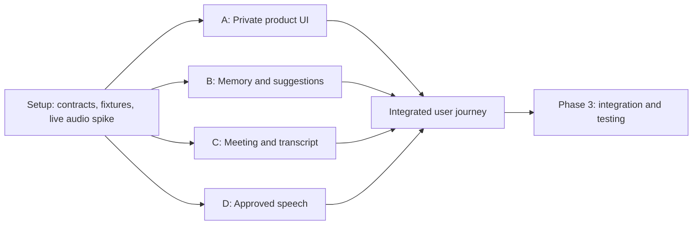

# Phase 2 — Features with parallel workstreams

Status: not started. Depends on [Phase 1](01-SETUP.md).

Read [PRD](../PRD.md) for R01–R13 and [Architecture](../ARCHITECTURE.md) for contracts, route ownership, and state machines. This phase turns the working setup connection into the product.

## Coordination model

Use four bounded workstreams when enough contributors are available. These can be human teammates or subagents explicitly authorized for the implementation session. No subagents were launched for this planning task.

If one developer implements the project, follow the same boundaries sequentially: B's memory seed/retrieval, C's transcript/state, B's suggestion generation, A's panel, D's complete speech behavior, then the vertical checkpoint. There is no need to create separate repositories or a monorepo.

The integration owner alone changes shared contracts, dependency manifests/lockfile, root layout, auth, and the shared database module. A track requests a shared change with the concrete reason and affected consumers before it is incorporated. Independent files may be worked on concurrently. If Git is available, use isolated branches/worktrees for contributor submissions; do not run concurrent edits on the same shared file.

## Dependency map

Tracks use agreed fixtures while dependencies are incomplete. Replace mocks at an early vertical checkpoint, not only at the end of Phase 2. Rough budget: 10–20 elapsed hours with parallel contributors, highly dependent on access and experience.

## Track A — Private operator experience

**Goal:** a usable companion panel that supports the entire decision-to-speech flow.

**Owns:** operator pages, `src/components/`, and their CSS. Coordinate changes to root layout and global CSS with the integration owner. Does not own `/bot/` or provider logic.

### Subtasks

- A1: Build the profile/memory/meeting launch screen against agreed contracts. Provide fields for role, priorities, tone, examples, titled note text, and confirmed fact relationships.
- A2: Build meeting status and recent transcript display. Let the operator select a question or provide a short request.
- A3: Build the three assistance actions and suggestion card with source inspection, edit, dismiss, refresh, and Speak to meeting.
- A4: Preserve edits when new transcript arrives. Show stale-context review, missing context, generation errors, and disabled speech while media is unavailable.
- A5: Add preparing/speaking/completed/uncertain states, Stop speaking, and End session. Keep the stop control reachable by keyboard.
- A6: Connect the real routes as tracks B/C/D become available; keep explicit fixture mode for testing only.

### Acceptance and submission

Demonstrate R02–R09 controls and R11–R12 states at a narrow companion width (approximately 360 px) and full desktop width. Verify visible labels, focus, keyboard operation, readable evidence, loading/error states, and no accidental auto-submit when editing. Native controls should carry the basic accessibility behavior.

Submit source paths, screenshots of ready/error/stale/speaking states, the route contracts consumed, and any unresolved backend dependency. UI screenshots alone do not prove live speech.

## Track B — Personal memory and suggestion generation

**Goal:** produce useful drafts from real, bounded, inspectable context.

**Owns:** `memory.ts`, `suggestions.ts`, profile/memory/suggestion routes, prompt/schema definitions, and memory/suggestion checks. Reuses the shared database driver and auth.

### Subtasks

- B1: Implement profile, source, and confirmed-fact read/write/delete with ownership and size validation.
- B2: Implement fixed project retrieval and dependency/owner traversal. Retain dates/status and source excerpts. Exclude private/proposed/superseded evidence from generation as specified.
- B3: Assemble a snapshot of selected/recent utterances, profile style, and retrieved context. Bound payload size; record transcript revision.
- B4: Implement one structured LLM call with modes answer/support/clarify. Handle model refusal, timeout, malformed output, missing context, and invented evidence IDs.
- B5: Store suggestion versions and support edits/dismissal. Do not turn generated text into confirmed facts.
- B6: Invalidate affected drafts when referenced source data is removed. Provide the current-version check used by track D.

### Acceptance and submission

Demonstrate R02, R03, R06, R07, and R08 with the fictional Atlas graph. Leave runnable checks for evidence-ID validation, private-source exclusion, superseded-fact exclusion, and missing-context behavior. Live model output should be manually reviewed for relevance; assert-based checks should test deterministic boundaries instead of expecting exact model wording.

Submit the seed/query evidence, fixture cases, provider/model used, observed response times, check results, and a clear list of any limits affecting the UI.

## Track C — Meeting lifecycle and transcript

**Goal:** a reliable, observable connection between the actual meeting and application state.

**Owns:** `meetings.ts`, `transcripts.ts`, session routes, Recall webhook routes, lifecycle normalization, and transcript ingestion checks.

### Subtasks

- C1: Complete Meet URL validation and single-active-session reservation. Coordinate media URL creation with track D.
- C2: Map Recall lifecycle events to app states, including waiting-room, permission/admission failure, ended, and uncertain creation outcome.
- C3: Verify raw webhook signatures with actual configured secrets and reject invalid/unmapped events before state mutation.
- C4: Normalize committed utterances with speaker/timestamp metadata, deduplicate deliveries, handle provider corrections, and maintain transcript revision.
- C5: Implement bounded private state reads for panel polling. Preserve bot readiness separately from transcript content.
- C6: Implement end/remove/reconcile and local ended-session cleanup. Coordinate cancellation/token revocation with D. Record provider-retained artifacts and cleanup behavior.

### Acceptance and submission

Demonstrate R04, R05, and the session portion of R11–R12. Leave runnable checks for duplicate/out-of-order events, invalid signatures, wrong session association, and terminal-state handling. Test one actual admission failure or controlled equivalent without hiding it behind a generic error.

Submit real-call transcript/lifecycle evidence, deduplication results, webhook configuration notes without secrets, and the normalized states consumed by A/D.

## Track D — Approval, bot media, and ElevenLabs voice

**Goal:** the meeting hears exactly the contribution the operator approved, with controllable playback.

**Owns:** `speech.ts`, speech routes, `/bot/[sessionId]`, media bootstrap/command/audio routes, and speech transition checks. Uses shared auth primitives; does not change them independently.

### Subtasks

- D1: Complete the scoped one-use media bootstrap validated in setup and heartbeat/readiness behavior.
- D2: Implement immutable approval snapshots, version/revision checks, duplicate request handling, command expiry, and one active command per session.
- D3: Implement atomic media claims and protected audio retrieval; generate speech from stored approved text only.
- D4: Play short complete audio using the browser media element; acknowledge start/end/failure. The public tile contains no private material.
- D5: Implement Stop, cancellation during synthesis/playback, provider-stop fallback, session-end revocation, and uncertain outcomes after acknowledgement loss.
- D6: Measure approval-to-first-audio and stop latency with a second participant. Only add streaming playback if the complete-audio baseline demonstrably misses the target.

### Acceptance and submission

Demonstrate R10 and speech portions of R11–R12. Leave runnable checks for repeated approval, stale/edited versions, cross-session media access, unauthorized text submission, cancellation, and replay prevention after reload.

Submit an actual remote-hearing result, observed timings, transition check results, and any provider/browser limitation. A successful ElevenLabs API response alone does not prove delivery into the meeting.

## Early vertical checkpoint

As soon as B can return a real draft, C can supply a real transcript, and D can accept approval, the integration owner joins them through A:

1. Start an actual meeting and ask the Atlas launch question.
2. Request an answer from the panel using that transcript.
3. Inspect one retrieved source and edit a short phrase.
4. Approve and hear the edited version remotely.
5. Stop or end, and inspect actual persisted state.

Fix contract mismatches here. Do not keep polishing disconnected tracks while the core journey is broken.

## Submission format for every track

Each track provides one concise reviewable completion note in `docs/submissions/<track>.md` when work actually exists:

- Delivered behavior and PRD requirement IDs.
- Files changed and shared-contract/dependency changes, if any.
- Verification commands/results and relevant live evidence.
- Fixtures still in use, known failures, and blocked dependencies.
- Exact next integration step.

Create a PR only if a remote and PR workflow exist. Otherwise a local branch/diff plus the completion note is sufficient. Never fabricate a PR link or label untested work complete.

## Phase gate

- [ ] All four track submissions are available and reviewed by the integration owner.
- [ ] Shared contracts have one consistent implementation.
- [ ] The early vertical checkpoint passed with real providers and a real meeting.
- [ ] Every feature's required errors and access checks exist.
- [ ] `pnpm lint`, `pnpm typecheck`, `pnpm check:core`, and `pnpm build` pass on the integrated state.
- [ ] Remaining issues are listed for Phase 3, with no silent fixture fallback.

Track merge order when needed: shared changes first, B memory foundation, C state/transcripts, B suggestions, D complete speech, then A final connections. This is an integration order; coding can proceed independently against the frozen contracts.
